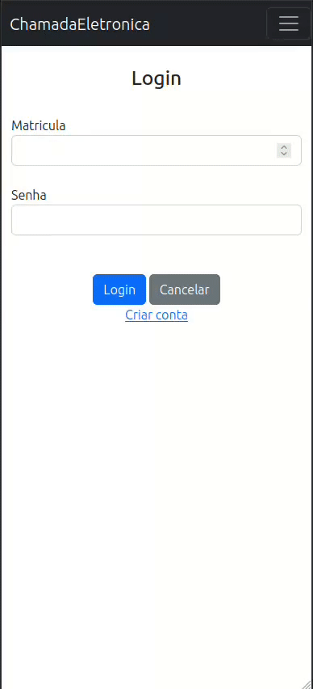

# Chamada Eletronica

Projeto de Engenharia de Software: Proposta de solução para uma versão eletrônica e colaborativa/descentralizada da chamada de presença.

- Experimente: [chamadaeletronica.oseiasromeiro.repl.co](https://chamadaeletronica.oseiasromeiro.repl.co)
- Template: [oseias-romeiro/flask_template](https://github.com/oseias-romeiro/flask_template)

## Descrição

Neste projeto foi criado 5 entidades (user, turma, turmas, chamada, frequencias), nos quais se ligam entre si e permite ao usuário-professor criar turmas, adicionar usuários-alunos e criar chamada para o dia. O usuário-aluno, caso esteja na turma, pode responder a frequencia, se o professor já ter criado a chamada no dia, utilizando o qrcode fornecido para o professor. Assim que a chamada é respondida, o professor pode ver uma lista de usuários presentes e reijar um ponto de presença de um aluno e o aluno pode ver se em determinado dia estava presente ou não.

Neste projeto, foi desenvolvida uma aplicação de chamada de presença online, composta por cinco entidades: `user`, `turma`, `turmas`, `chamada` e `frequencias`.

A aplicação permite que professores criem turmas, adicionem alunos a essas turmas e realizem chamadas diárias. Os alunos, se estiverem matriculados em uma turma, podem responder às chamadas utilizando o QR Code fornecido pelo professor. Uma vez que a chamada é respondida, o professor pode visualizar uma lista dos alunos presentes e registrar a presença de um aluno. Os alunos, por sua vez, podem consultar se estiveram presentes ou ausentes em um determinado dia.

Essa aplicação proporciona uma maneira conveniente e eficiente de gerenciar a presença dos alunos em aulas ou atividades acadêmicas por meio de um sistema online. Ela simplifica o processo de chamada, permitindo aos professores obter rapidamente informações atualizadas sobre a presença dos alunos, além de oferecer aos alunos a facilidade de responder às chamadas por meio do uso de QR Codes.


## Ferramentas

Para o projeto foi utilizado:
  - **Flask**
  - **sqlite3**
  - **SQLAlchemy2**
  - **Werkzeug**
  - **GeoDB**
  - **GIT**


### APIs

Foi utilizado a api GeoDB para obter informações de coordenadas coletadas pela api Geolocation no navegador do usuário. Os dados são salvos e utilizados para registrar a posição do professor quando uma chamada é criada e calculo de distância quando um aluno responde a chamada. A diferença é mostrada para o professor, podendo ele rejeitar a presença do aluno.

> É opcional a utilização da API e não é obrigatório autorizar a geolocalização para o aluno responder a chamada.

### Env

Variaveis de ambiente são configurados em [config.py](./config.py)

- **RAPID_KEY** : deve manter a chave rapid para a utilização da api
- **ENV** : Configura de acordo com um ambiente (Produção, Desenvolvimento (default), Teste [PRD|DSV|TST])

## Telas




## Setup

### database
```sh
flask db init
flask db migrate -m "init"
flask db upgrade
```

### seeds
```sh
flask seed users
flask seed classes
flask seed user_class
```

## Execução 

```sh
pip install -r requirements.txt
unicorn -b "0.0.0.0:5000" wsgi:app
```

Acesse: [localhost:5000](http://localhost:5000)
