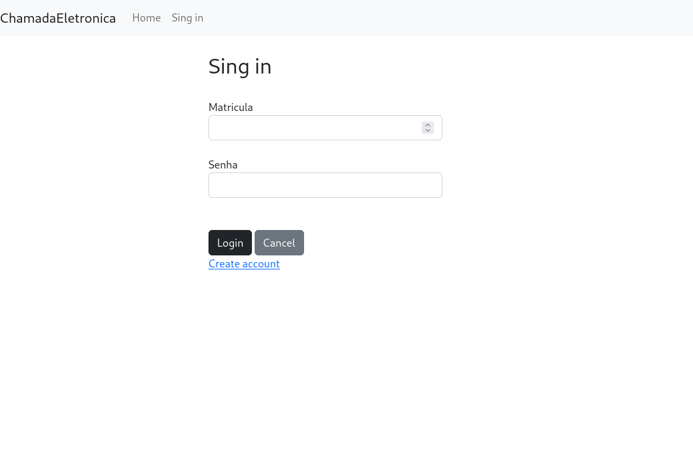
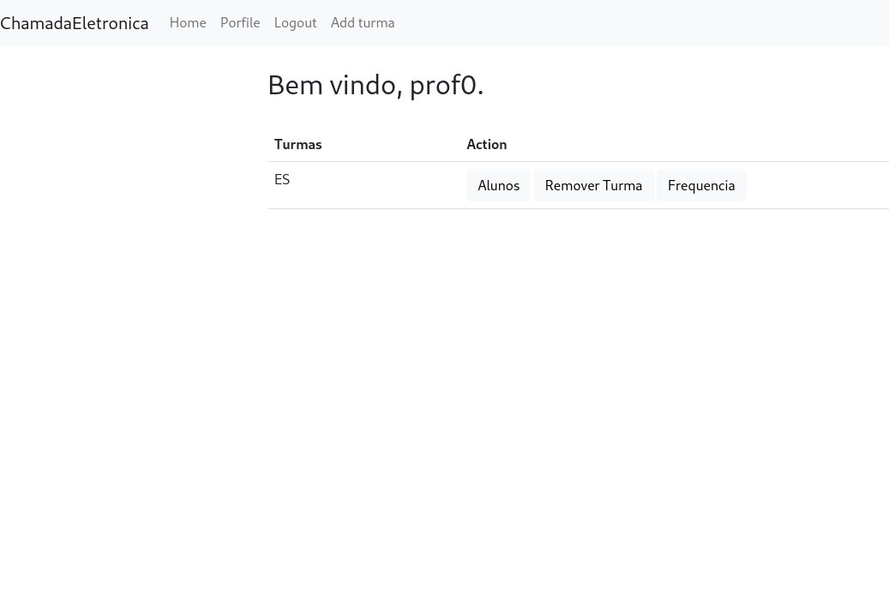

# Chamada Eletronica

Projeto de Engenharia de Software: Proposta de solução para uma versão eletrônica e colaborativa/descentralizada da chamada de presença.

- Experimente: [chamadaeletronica.oseiasromeiro.repl.co](https://chamadaeletronica.oseiasromeiro.repl.co)
- Template: [oseias-romeiro/flask_template](https://github.com/oseias-romeiro/flask_template)

## Descrição

Neste projeto foi criado 5 entidades (user, turma, turmas, chamada, frequencias), nos quais ligam entre si e permite ao usuário-professor criar turmas, adicionar outros usuários-alunos e criar chamada para o dia. O usuário-aluno, pode responder a frequencia, se o professor já ter criado a chamada para o dia, utilizando o qrcode disponível para o professor. O projeto está utilizando sqlite, com os seguintes dados de exemplos:

|Matricula|Professor|
|--- |--- |
|100000000|Sim|
|200000000|Sim|
|111111111|Não|
|222222222|Não|

> Todas as senhas são `1234`

## Ferramentas

Para o projeto foi utilizado:
  - **Flask**
  - **sqlite3**
  - **SQLAlchemy**
  - **Werkzeug**


## Algumas telas

- Tela de Login



- Painel do professor


<br><br>

## Execução 

```sh
  pip install -r requirements.txt
  python3 app.py
```

